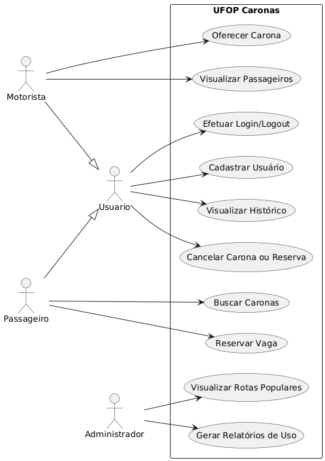
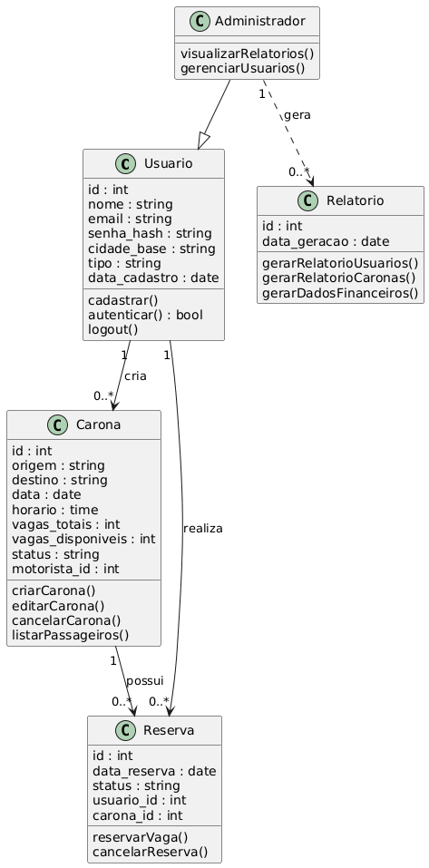
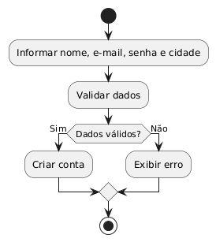
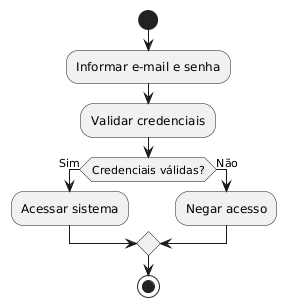
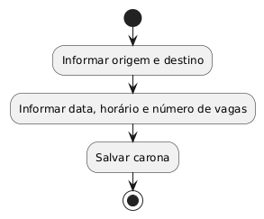
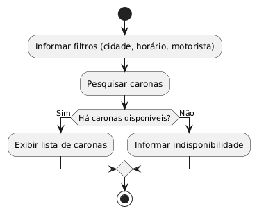
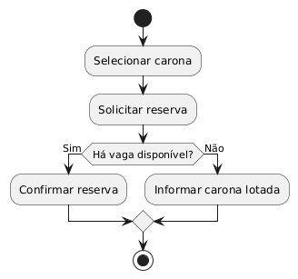

## 🚗 **Sistema de Caronas Universitárias — UFOP**

### 🎯 **Escopo do Sistema**

O **UFOP Caronas** é um sistema web colaborativo desenvolvido para **facilitar o deslocamento dos alunos da UFOP entre campus e cidades próximas**, conectando **motoristas** (que oferecem caronas) e **passageiros** (que procuram transporte).
O sistema permitirá o **cadastro de usuários**, **criação e reserva de caronas**, **gestão de vagas e histórico de viagens**, além de **relatórios administrativos** sobre o uso da plataforma.

O foco é implementar um **protótipo funcional**, com backend em **Python (Flask)** e banco de dados **SQLite**, aplicando os conceitos de **Engenharia de Software, metodologias ágeis e boas práticas de versionamento com GitHub**.
A equipe utilizará o **Notion** para organização do backlog, sprints e tarefas.

---

## ⚙️ **Tecnologias e Ferramentas**

* **Linguagem:** Python
* **Framework Web:** Flask
* **Banco de Dados:** SQLite (via SQLAlchemy ORM)
* **Frontend:** HTML, CSS e JavaScript (Bootstrap)
* **Versionamento:** GitHub
* **Gerenciamento de tarefas:** Notion (para controle do backlog e progresso do sprint)

---

## 👥 **Equipe e Papéis**

| Integrante              | Papel          | Descrição das Responsabilidades                                                                                                                                                     |
| ----------              | -------------- | ----------------------------------------------------------------------------------------------------------------------------------------------------------------------------------- |
| Geovanna Paulina        | Backend        | Desenvolvimento do módulo de usuários (cadastro, login, autenticação e controle de sessões). Integração com banco de dados e rotas Flask.                                           |
| Ana Carolina Ferreira   | Backend        | Implementação do módulo de oferta de caronas (CRUD de caronas: criar, editar, excluir e listar). Relacionamento entre motoristas e viagens no banco de dados.                       |
| Camille Silva           | Frontend       | Desenvolvimento do módulo de busca e reserva de caronas (consultas SQL, filtragem por cidade, data e horário; reserva de vagas). Integração com frontend.                           |
| Brenda Mel              | Frontend       | Implementação do módulo de cancelamento e histórico de caronas (usuário pode cancelar reservas ou ver histórico de viagens oferecidas/participadas). Criação de tabelas auxiliares. |
| Danilo Carvalho         | Fullstack / BD | Desenvolvimento dos relatórios administrativos (uso do sistema, rotas mais populares, total de usuários ativos). Queries analíticas no banco de dados.                              |
| Lucas Sobrosa           | Fullstack / BD | Integração geral do sistema, padronização das rotas Flask, configuração inicial do projeto (banco, templates, rotas base) e deploy local.                                           |

---

## 🧩 **Backlog do Produto (10 histórias principais)**

1. Como usuário, quero **me cadastrar no sistema** com nome, e-mail, senha e cidade base.
2. Como usuário, quero **fazer login e logout** para acessar minhas caronas e reservas.
3. Como motorista, quero **oferecer uma carona**, informando origem, destino, data, horário e número de vagas.
4. Como passageiro, quero **buscar caronas disponíveis** filtrando por cidade, horário e motorista.
5. Como passageiro, quero **reservar uma vaga** em uma carona disponível.
6. Como motorista, quero **visualizar os passageiros que reservaram minhas caronas**.
7. Como usuário, quero **cancelar uma carona ou reserva**.
8. Como usuário, quero **ver meu histórico de caronas oferecidas e recebidas**.
9. Como administrador, quero **gerar relatórios de uso do sistema** (quantidade de usuários, caronas e reservas).
10. Como administrador, quero **ver as rotas mais utilizadas** (origem/destino mais frequentes).

---

## 🚀 **Backlog do Sprint 1 (duas histórias por pessoa)**

| Pessoa | Implementações                               | Histórias Correspondentes | Descrição Técnica                                                                                                                                     |
| ------ | -------------------------------------------- | ------------------------- | ----------------------------------------------------------------------------------------------------------------------------------------------------- |
| **1**  | Cadastro de usuário + Login e autenticação   | #1 e #2                   | Implementar formulários e rotas Flask (`/cadastro`, `/login`); criar tabela `usuarios`; hash de senhas com `werkzeug.security`; sessões Flask.        |
| **2**  | Cadastro e gerenciamento de caronas          | #3 e #4                   | Criar tabela `caronas` com chaves estrangeiras para `usuarios`; rotas CRUD (`/nova_caronas`, `/minhas_caronas`); filtros de busca por origem/destino. |
| **3**  | Reserva de caronas + cancelamento de reserva | #5 e #7                   | Criar tabela `reservas` (relaciona usuário e carona); rotas `/reservar/<id>` e `/cancelar/<id>`; verificação de vagas disponíveis.                    |
| **4**  | Histórico de caronas e reservas              | #6 e #8                   | Consultas SQL para listar caronas oferecidas e recebidas; exibição em templates Flask (`historico.html`).                                             |
| **5**  | Relatórios de uso e rotas populares          | #9 e #10                  | Query SQL agregadas (`COUNT`, `GROUP BY`, `JOIN`) para gerar estatísticas; rotas `/relatorios` e `/rotas_populares`.                                  |
| **6**  | Integração geral e estrutura do sistema      | Todas de suporte          | Criação da estrutura do projeto Flask (app, models, templates, static); integração entre módulos; conexão e migração inicial do banco.                |

---

## 📈 Visão de Implementação

* **Banco de Dados:**
  * Tabelas: `usuarios`, `caronas`, `reservas`
  * Relacionamentos:
    * Um usuário pode oferecer várias caronas (1:N), assumindo o papel de motorista
    * Um usuário pode reservar várias caronas, e uma carona pode ter vários usuários (N:M), por meio da tabela `reservas`

* **Fluxo principal de uso:**

1. Usuário cria conta e faz login.
2. Motorista cadastra uma carona.
3. Passageiro busca e reserva uma vaga.
4. Sistema atualiza o número de vagas.
5. Ambos visualizam histórico e relatórios.

---

# 🛠️ Diagramas do Projeto

## 1. Diagrama de Casos de Uso

> Este diagrama descreve as funcionalidades do sistema **UFOP Caronas** a partir da perspectiva dos atores (Usuário, Motorista, Passageiro e Administrador), onde cada elipse representa uma das 10 histórias de usuário do backlog.

## 2. Diagrama de Classes

> Este diagrama de classes representa a estrutura estática do sistema UFOP Caronas, descrevendo as principais classes, seus atributos, métodos e os relacionamentos entre elas. O diagrama evidencia como as entidades do sistema (como Usuário, Carona, Reserva e Administrador) se organizam e interagem, servindo como base para a implementação do backend e para o entendimento da modelagem orientada a objetos do sistema.

## 3. Diagrama de Atividades
1. Como usuário, quero **me cadastrar no sistema** com nome, e-mail, senha e cidade base.

2. Como usuário, quero **fazer login e logout** para acessar minhas caronas e reservas.

3. Como motorista, quero **oferecer uma carona**, informando origem, destino, data, horário e número de vagas.

4. Como passageiro, quero **buscar caronas disponíveis** filtrando por cidade, horário e motorista.

5. Como passageiro, quero **reservar uma vaga** em uma carona disponível.

## 4. Protótipo de Telas

[👉 Acessar Protótipo no Figma](https://www.figma.com/proto/JX83ecF6aAnFnJHsSlapW5/APP_CARONAS_UFOP?page-id=0%3A1&node-id=2-7712&p=f&viewport=142%2C104%2C0.42&t=nFNyRpldk4Q3vKQJ-1&scaling=scale-down&content-scaling=fixed)

[👉 Acessar Protótipo em PDF](https://github.com/CamillejSOn/SistemasCaronasUFOP/blob/main/APP_CARONAS_UFOP.pdf)
